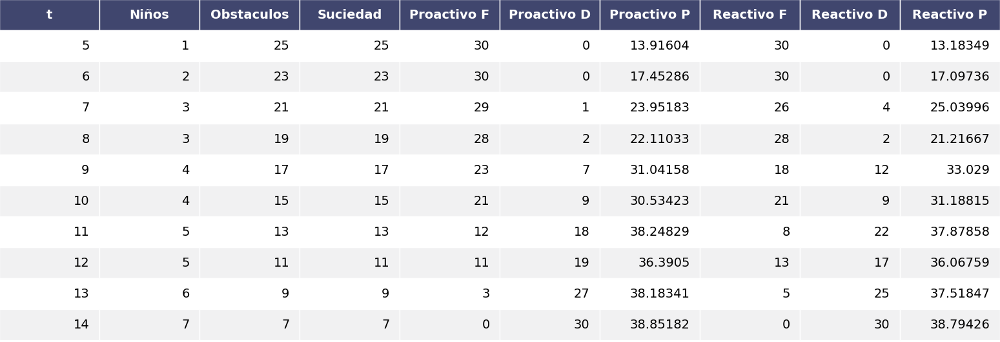

# Simulación - Agentes  

  
  

### Denis Gómez Cruz  
### C-412  

  
  
  
  
  
  
  

### Requerimientos y ejecución:  

Se debe contar con los paquetes `pandas`, `numpy` y `matplotlib` para la ejecución del proyecto, para esto solo es necesario correr con `python3` el fichero `main.py`. Los resultados obtenidos mediante la ejecución se encontraran en el fichero `fig.png`.  

### Problema  

Se quieren usar varios modelos de agentes sobre un entorno (rectángulo de `N`x`M` en este caso) donde hay bebes que pueden moverse y generan suciedad. Los agentes tienen como tarea mantener limpio el entorno y llevar todos los bebes hacia el corral (un conjunto de posiciones especiales en el entorno). Para más de detalles del problema a resolver véase la orientación del proyecto en el archivo `orden.pdf`.  

### Ideas para la solución y implementación del problema  

Se creo una clase `environment` (véase `environment.py`) que es la que representa el entorno. Esta es la encargada de mantener el estado de cada casilla (sucia, limpia, obstáculo, etc...) y los agentes, también contiene algunos métodos que son de utilidad para los agentes. El método `simulate` inicia la ejecución de la simulación teniendo en cuenta los posibles estados finales y retorna una serie de valores que son el resultado de la experimentación los cuales se verán mas adelante.  

En el archivo `agents.py` se encuentran varias clases que son implementaciones de distintos agentes y todos comparten el entorno en el que se encuentran, la posición donde están dentro de este y un método `move` que es el encargado de ejecutar la acción que el agente decida cuando sea necesario.  

- **child** representa a los niños y simula el comportamiento de estos, posible movimiento y ensuciar de acorde al comportamiento descrito que estos deben tener.  

- **robot** representa a el robot de casa, contiene todos los métodos necesarios para realizar las acciones de estos como limpiar, recoger niños, moverse, etc..., también contiene métodos primitivos fundamentales para obtener información sobre el ambiente y poder implementar diferentes estrategias.  

- **robot_proactive** especialización del agente **robot** el cual usa una estrategia pro-activa.  

- **robot_reactive** especialización del agente **robot** el cual usa una estrategia reactiva.  

### Agentes  

El agente pro-activo tiene un comportamiento _goal-directed_, tras varias experimentaciones con distintas estrategias la que mejores resultados obtuvo, establece como meta llevar los niños al corral primero, limpiando siempre que sea posible y después encargarse de moverse hacia las casillas que aun permanezcan sucias.  

EL agente reactivo es similar al agente pro-activo, pero tiene en mayor medida el entorno, pudiendo cambiar su comportamiento bajo determinadas situaciones según estime conveniente, por lo cual este tiene una mejor respuesta ante los cambios en este.   

### Simulación  

  

En la tabla anterior se hicieron varias simulaciones 30 por cada ambiente, las letras (`F`, `D`, `P`) representan si el robot finalizo (ubico todos los niños en el corral y todas las casillas están limpias), el robot fue despedido (se alcanzó el 60% de casillas sucias) y el porciento de casillas de casillas sucias como promedio durante toda la ejecución respectivamente.  

Como se puede apreciar el robot pro-activo se comporta mejor con pocos niños dado que su estrategia es buena cuando hay pocos niños, sin embargo, el robot reactivo mantiene un menor porciento de casillas sucias en la mayoría de las simulaciones, incluso se comporta mejor cuando la cantidad de niños es grande, lo cual tiene sentido ya que el porciento de suciedad puede ser muy grande y una simple estrategia como la del robot-activo no es buena en estos casos.  
